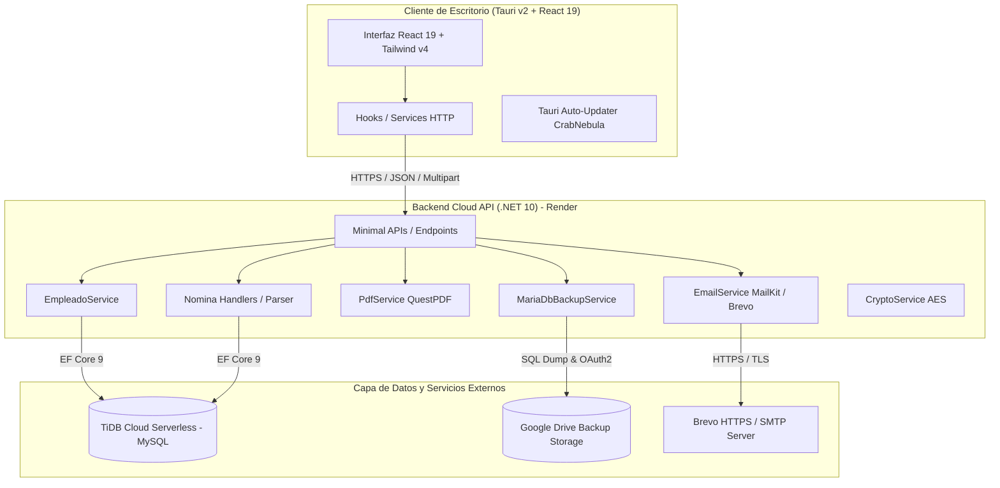

# 🏢 Sistema de Nómina y Procesamiento Quincenal — ENFOCO

[](https://dotnet.microsoft.com/)
[](https://tauri.app/)
[](https://react.dev/)
[](https://tailwindcss.com/)
[-4479A1?logo=mysql&logoColor=white)](https://tidbcloud.com/)
[](https://sistemanomina.onrender.com)
[](#)

---

## 📑 Tabla de Contenidos
1. [Visión General y Contexto No Técnico](#-1-visión-general-y-contexto-no-técnico)
   - [¿Qué es el Sistema de Nómina ENFOCO?](#qué-es-el-sistema-de-nómina-enfoco)
   - [Problemas de Negocio que Resuelve](#problemas-de-negocio-que-resuelve)
   - [Flujo de Trabajo Operativo](#flujo-de-trabajo-operativo)
   - [Módulos Principales del Negocio](#módulos-principales-del-negocio)
   - [Beneficios Clave para la Organización](#beneficios-clave-para-la-organización)
2. [Arquitectura y Contexto Técnico](#-2-arquitectura-y-contexto-técnico)
   - [Pila Tecnológica Integral](#pila-tecnológica-integral)
   - [Diagrama de Arquitectura de la Solución](#diagrama-de-arquitectura-de-la-solución)
   - [Estructura del Proyecto y Repositorio](#estructura-del-proyecto-y-repositorio)
   - [Modelo de Datos y Persistencia](#modelo-de-datos-y-persistencia)
   - [Catálogo de Endpoints y API REST](#catálogo-de-endpoints-y-api-rest)
   - [Reglas de Negocio Fiscales y Laborales (República Dominicana)](#reglas-de-negocio-fiscales-y-laborales-república-dominicana)
   - [Seguridad, Criptografía y Respaldos en Nube](#seguridad-criptografía-y-respaldos-en-nube)
   - [Pruebas Automatizadas y Aseguramiento de Calidad](#pruebas-automatizadas-y-aseguramiento-de-calidad)
3. [Guía de Instalación, Configuración y Despliegue](#-3-guía-de-instalación-configuración-y-despliegue)
   - [Requisitos Previos del Sistema](#requisitos-previos-del-sistema)
   - [Ejecución en Entorno de Desarrollo](#ejecución-en-entorno-de-desarrollo)
   - [Compilación y Empaquetado de la Aplicación de Escritorio](#compilación-y-empaquetado-de-la-aplicación-de-escritorio)
   - [Despliegue del Backend con Docker / Render](#despliegue-del-backend-con-docker--render)
4. [Historial de Versiones Recientes](#-4-historial-de-versiones-recientes)

---

## 🏢 1. Visión General y Contexto No Técnico

### ¿Qué es el Sistema de Nómina ENFOCO?
El **Sistema de Nómina y Procesamiento Quincenal ENFOCO** es una plataforma integral de escritorio corporativa (compatible con **Windows**, **macOS** y **Linux / CachyOS**) diseñada para automatizar, blindar y agilizar la gestión de recursos humanos y el cálculo de nóminas quincenales en empresas e instituciones.

Permite administrar el catálogo maestro de empleados, importar planillas de pago en formato Excel sin importar su orden de columnas, verificar los importes en tiempo real, liquidar las nóminas con trazabilidad histórica inalterable, generar automáticamente volantes de pago institucionales en PDF y enviarlos masivamente a los correos de los colaboradores con un solo clic.

---

### Problemas de Negocio que Resuelve

| Desafío Tradicional | Solución Implementada en ENFOCO |
| :--- | :--- |
| **Errores en archivos Excel cambiantes**: Si las columnas cambian de orden o se usan nombres distintos, los sistemas convencionales fallan. | **Motor Inteligente de Excel Universal**: Detecta automáticamente encabezados, alias sinónimos, formatos numéricos con símbolos de moneda y caracteres especiales. |
| **Duplicación de trabajo y discrepancias**: Empleados en planilla que no existen en el sistema o viceversa. | **Cruce Automático en Tiempo Real**: Valida códigos de empleados contra el maestro centralizado, alertando de registros no encontrados antes del cierre. |
| **Entrega lenta y manual de recibos de pago**: Descargar PDFs uno por uno y enviarlos por correo manual consume horas de trabajo de RRHH. | **Generación y Despacho Masivo en Segundos**: Generación instantánea de PDFs con diseño institucional y envío automático vía API en la nube (Brevo / SMTP) con informe de entregas. |
| **Pérdida de trazabilidad histórica**: Imposibilidad de auditar nóminas pasadas o reimprimir comprobantes idénticos. | **Histórico Inmutable y Auditable**: Toda quincena procesada queda sellada en base de datos con filtros por año, mes, quincena y exportación a Excel. |
| **Cumplimiento legal y fiscal en Rep. Dominicana**: Errores en retención de TSS (AFP/SFS), ISR según escalas DGII y cédulas inválidas. | **Validación y Cálculo Fiscal Normativo**: Validador de cédula mediante algoritmo Módulo 10 y cálculo de deducciones ajustado a la ley dominicana. |

---

### Flujo de Trabajo Operativo

```
 ┌────────────────┐       ┌─────────────────┐       ┌─────────────────┐
 │ 1. Maestro de  │ ───>  │ 2. Carga Excel  │ ───>  │ 3. Staging &    │
 │    Empleados   │       │    Quincenal    │       │    Previsualizar│
 └────────────────┘       └─────────────────┘       └─────────────────┘
                                                             │
 ┌────────────────┐       ┌─────────────────┐                ▼
 │ 5. Envío Masivo│ <───  │ 4. Cierre de    │ <──────────────┘
 │    de Volantes │       │    Nómina       │
 └────────────────┘       └─────────────────┘
```

1. **Gestión de Empleados**: Registro, edición y mantenimiento de datos personales, laborales, bancarios y de contacto.
2. **Carga de Novedades Quincenales**: Arrastre de la hoja de cálculo de la quincena (con sueldos, incentivos, horas extras, deducciones, préstamos).
3. **Mesa de Trabajo / Staging**: Inspección visual de las partidas, corrección de inconsistencias en caliente y recálculo automático de devengados, deducciones y neto a pagar.
4. **Cierre y Sellado**: Confirmación formal que guarda la nómina histórica de forma definitiva.
5. **Generación y Despacho**: Visualización individual de comprobantes PDF y envío masivo por correo electrónico a cada colaborador.

---

### Módulos Principales del Negocio

- 👥 **Módulo 1: Maestro de Personal y Empleados**
  - Directorio centralizado con búsqueda predictiva por nombre, apellido, cargo o cédula.
  - Indicadores clave de desempeño (KPIs): Total de plantilla, colaboradores activos e inactivos.
  - Sugerencia automática del próximo código correlativo para nuevos ingresos.
  - Validación en vivo de cédulas dominicanas y pasaportes.
  - Importación y exportación masiva en formato Excel (`.xlsx`).

- 💵 **Módulo 2: Procesamiento Quincenal de Pagos**
  - Asistente de carga rápida de planillas de pago.
  - Reconocimiento automático del período fiscal (1ra o 2da Quincena y Mes corriente).
  - Detección visual de discrepancias (empleados no registrados en el maestro).
  - Tabla interactiva con edición en caliente antes del cierre definitivo.

- 📄 **Módulo 3: Volantes de Pago Institucionales y Distribución Digital**
  - Recibos vectoriales en PDF de alta fidelidad con tipografía corporativa *Lato*, logotipo institucional y desglose contable (Sueldo Base, Incentivos, Horas Extras, AFP, SFS, ISR, Préstamos, Neto en números y letras).
  - Visor interactivo integrado en la aplicación de escritorio.
  - Disparador de envío masivo de correos electrónicos con adjuntos personalizados y reintentos ante fallas temporales.

- 📜 **Módulo 4: Archivo Histórico y Auditoría**
  - Consulta retrospectiva de nóminas cerradas organizadas por Año, Mes y Quincena (`1Q` / `2Q`).
  - Motor de búsqueda global para auditar el historial salarial de un empleado en cualquier período.
  - Re-exportación oficial a Excel de períodos anteriores y reimpresión de comprobantes en PDF.

- 📅 **Módulo 5: Agenda y Calendario de Nómina**
  - Calendario mensual interactivo con visualización de días de corte, fechas límite de novedades y días de pago.
  - Gestión de eventos y recordatorios corporativos sincronizados con la base de datos central.

---

### Beneficios Clave para la Organización

- **0% Errores de Cruce**: Garantiza que no se emitan pagos a personas no registradas o con cuentas bancarias erradas.
- **Ahorro de Tiempo**: Reduce el tiempo de liquidación y entrega de recibos de varias horas a escasos minutos.
- **Transparencia y Confianza Laboral**: Los empleados reciben oportunamente en sus correos un volante claro, detallado y profesional.
- **Respaldo y Seguridad**: Toda la información contable está respaldada de forma automática y cifrada en la nube.

---

## 💻 2. Arquitectura y Contexto Técnico

### Pila Tecnológica Integral

#### 🖥️ Frontend (Desktop Application)
- **Tauri v2**: Framework ultraligero basado en Rust para empaquetar aplicaciones nativas de escritorio seguras con bajo consumo de memoria y tamaño de binario reducido.
- **React 19**: Biblioteca declarativa de interfaces de usuario para una experiencia fluida y reactiva.
- **TypeScript 5.8**: Tipado estático riguroso para modelos, DTOs y componentes de UI.
- **Vite 7**: Servidor de desarrollo ultrarrápido y empaquetador optimizado.
- **Tailwind CSS v4**: Motor de utilidades CSS moderno con tokens de diseño personalizados.
- **Lucide Icons**: Conjunto de iconografía vectorial limpia y consistente.
- **SweetAlert2**: Notificaciones modales, confirmaciones y alertas enriquecidas.
- **Tauri Plugins**:
  - `@tauri-apps/plugin-updater`: Actualizaciones automáticas Over-The-Air (OTA) vía CrabNebula.
  - `@tauri-apps/plugin-process`: Gestión del ciclo de vida del proceso de escritorio.
  - `@tauri-apps/plugin-opener`: Apertura segura de archivos del sistema y enlaces web externos.

#### ⚙️ Backend (Cloud API Service)
- **.NET 10 (C# 14 / Minimal APIs)**: Arquitectura orientada a alto rendimiento, bajo consumo de recursos y endpoints ligeros.
- **Entity Framework Core 9 (Pomelo MySQL Provider)**: ORM con soporte completo de migraciones, transacciones ACID y consultas LINQ optimizadas.
- **QuestPDF**: Motor declarativo para renderizado vectorial de documentos PDF institucionales de alta resolución.
- **ExcelDataReader & ClosedXML**: Motores gemelos para lectura rápida sin dependencias COM y generación de libros Excel enriquecidos.
- **MailKit & MimeKit**: Biblioteca cliente SMTP/IMAP para autenticación segura (STARTTLS / SSL) y manipulación de adjuntos MIME.
- **Brevo REST API (HTTPS)**: Canal secundario y nativo para despacho de correos transaccionales directos desde la nube vía HTTP.
- **DataProtection & Cryptography**: Cifrado AES-256 de credenciales sensibles (claves SMTP) almacenadas en base de datos.
- **Google Drive API v3**: Servicio de respaldo periódico automatizado con autenticación OAuth2 de ciclo continuo mediante Refresh Tokens.
- **Swashbuckle / OpenAPI**: Documentación y consola interactiva de pruebas de la API disponible en `/swagger`.

#### ☁️ Infraestructura y Base de Datos
- **Base de Datos Principal**: TiDB Cloud Serverless (Compatible con MySQL 8.0) alojado en AWS Oregon con conexión SSL/TLS obligatoria y disponibilidad 24/7 permanente.
- **Alojamiento Backend**: Contenedor Linux Dockerizado en **Render** (`https://sistemanomina.onrender.com`).
- **Monitoreo Continuo**: Sonda HTTP en **UptimeRobot** sobre `/api/health` cada 5 minutos para garantizar operación activa 24/7.
- **Almacenamiento de Respaldos**: Google Drive Cloud Storage con retención inteligente de copias de seguridad.

---

### Diagrama de Arquitectura de la Solución



---

### Estructura del Proyecto y Repositorio

```
SistemaNomina/
├── backend/                               # Proyecto API .NET 10
│   ├── Application/Features/              # CQRS Commands & Queries
│   │   ├── Empleados/Queries/             # Consultas y exportaciones de personal
│   │   └── Nomina/                        # Lógica de cierre, histórico y agenda
│   ├── Data/
│   │   ├── AppDbContext.cs                # Contexto de base de datos EF Core
│   │   └── DbInitializer.cs               # Semillero inicial de datos
│   ├── DTOs/                              # Objetos de Transferencia de Datos
│   ├── Endpoints/                         # Rutas Minimal API (/empleados, /nomina, /config)
│   ├── Migrations/                        # Historial de migraciones EF Core
│   ├── Models/                            # Entidades del Dominio (Empleado, NominaPeriodo...)
│   ├── Services/
│   │   ├── Excel/                         # Parsers resilientes y Helpers OpenXML
│   │   ├── Pdf/                           # Plantillas de Volantes de Pago QuestPDF
│   │   ├── CalculadorDeduccionesRD.cs     # Deducciones fiscales de Rep. Dominicana
│   │   ├── ValidadorDocumentoRD.cs        # Algoritmo Módulo 10 para Cédula RD
│   │   ├── EmailService.cs                # Despacho por Brevo HTTPS / MailKit SMTP
│   │   ├── CryptoService.cs               # Cifrado de credenciales del sistema
│   │   └── MariaDbBackupService.cs        # Motor de copias a Google Drive
│   ├── Dockerfile                         # Contenedor optimizado de producción
│   └── Program.cs                         # Configuración del Host, DI y Middlewares
├── backend.Tests/                         # Suite de Pruebas Unitarias e Integración (xUnit)
│   ├── CryptoServiceTests.cs              # Pruebas de cifrado/descifrado
│   ├── NominaFallbackTests.cs             # Pruebas del parser universal de Excel
│   ├── ValidadorDocumentoRDTests.cs       # Pruebas de validación de Cédulas RD
│   └── GenerarExcelPruebaTests.cs         # Generadores de matrices de prueba
├── sistema-nomina/                        # Aplicación Frontend de Escritorio
│   ├── src/                               # Código Fuente React 19 + TypeScript
│   │   ├── components/                    # Componentes modulares y reutilizables
│   │   │   ├── common/                    # Tablas, selectores, paginadores, filtros
│   │   │   ├── dashboard/                 # Métricas, KPIs y accesos rápidos
│   │   │   ├── employees/                 # Formularios y listados de personal
│   │   │   ├── events/                    # Agenda y vista de calendario
│   │   │   └── payroll/                   # Mesa de trabajo, visores PDF y modales
│   │   ├── config/                        # Configuración de URLs de API
│   │   ├── hooks/                         # Hooks reactivos (useEmployees, usePayroll...)
│   │   ├── pages/                         # Vistas principales de la aplicación
│   │   └── types/                         # Definiciones de tipos TypeScript
│   ├── src-tauri/                         # Código Nativo Rust / Tauri v2
│   │   ├── src/main.rs                    # Entrypoint y configuración de plugins
│   │   └── tauri.conf.json                # Configuración de empaquetado, permisos y updater
│   ├── package.json                       # Dependencias y scripts de Node.js
│   └── vite.config.ts                     # Configuración de compilación Vite + Tailwind v4
└── README.md                              # Documentación del sistema
```

---

### Modelo de Datos y Persistencia

#### 1. Entidad `Empleado`
Representa el expediente maestro del colaborador.
- `Id` (int, PK autoincremental)
- `Codigo` (string, clave de negocio única, ej. `"EMP-001"`)
- `Nombres` & `Apellidos` (string)
- `TipoDocumento` (string: `"1"` para Cédula, `"2"` para Pasaporte)
- `DocumentoIdentidad` (string, validado y normalizado)
- `Cargo` & `Departamento` (string)
- `SueldoBase` (decimal)
- `CuentaBancaria` (string)
- `CorreoElectronico` (string)
- `Estatus` (string: `"ACTIVO"` / `"INACTIVO"`)
- `FechaIngreso` (DateTime)

#### 2. Entidad `NominaPeriodo`
Cabecera del cierre quincenal de nómina.
- `Id` (int, PK)
- `Anio` (int) & `Mes` (int, 1-12)
- `Quincena` (string: `"1Q"` o `"2Q"`)
- `Concepto` (string)
- `TotalDevengado` (decimal)
- `TotalDeducciones` (decimal)
- `TotalNeto` (decimal)
- `FechaProcesado` (DateTime)
- `Detalles` (ICollection<`NominaDetalle`>)

#### 3. Entidad `NominaDetalle`
Desglose individual e inalterable de la liquidación de cada empleado en un período.
- `Id` (int, PK)
- `NominaPeriodoId` (FK a `NominaPeriodo`)
- `EmpleadoId` (FK opcional a `Empleado`)
- `CodigoEmpleado`, `NombreCompleto`, `Departamento`, `Cargo` (instantánea al momento del cierre)
- `SueldoBase`, `HorasExtras`, `Incentivo`, `Reembolso`, `Bonificacion`
- `TotalDevengado`
- `Afp`, `Sfs`, `Isr`, `Prestamos`, `OtrasDeducciones`
- `TotalDeducciones`
- `NetoAPagar`

#### 4. Entidad `EventoRecordatorio`
Eventos corporativos y recordatorios en el calendario.
- `Id` (int, PK)
- `Titulo`, `Descripcion`, `Tipo` (string)
- `Fecha` (DateTime), `HoraInicio`, `HoraFin` (string)
- `Completado` (bool)

#### 5. Entidad `ConfiguracionSistema`
Parámetros globales de la aplicación y credenciales SMTP cifradas.
- `SmtpServer`, `SmtpPort`, `SmtpSenderName`, `SmtpSenderEmail`, `SmtpUsername`
- `SmtpPassword` (cadena cifrada en AES-256)
- `SmtpEnableSsl` (bool)

---

### Catálogo de Endpoints y API REST

#### 👥 Módulo de Empleados (`/api/empleados`)
- `GET /api/empleados`: Consulta paginada de empleados con búsqueda por término, filtro por estatus y conteos agregados.
- `GET /api/empleados/siguiente-codigo`: Retorna el próximo código correlativo sugerido (`EMP-XXX`).
- `POST /api/empleados`: Registra un nuevo empleado validando cédula o pasaporte.
- `PUT /api/empleados/{codigo}`: Actualiza los datos de un empleado existente.
- `DELETE /api/empleados/{codigo}`: Elimina un empleado del sistema.
- `POST /api/empleados/guardar-lote`: Sincronización masiva de lista de empleados (Upsert).
- `POST /api/empleados/toggle-estatus-todos`: Activa o desactiva a todos los empleados en bloque.
- `GET /api/empleados/exportar-excel`: Exporta el catálogo maestro a un archivo `.xlsx`.

#### 💵 Módulo de Nómina Quincenal (`/api/nomina`)
- `POST /api/nomina/preview-quincena`: Recibe el archivo Excel, ejecuta el parsing universal y cruza los registros con la base de datos.
- `POST /api/nomina/recalcular`: Recalcula devengados, deducciones, netos individuales y totales consolidados.
- `POST /api/nomina/procesar-quincena`: Registra formalmente el cierre de nómina en base de datos.
- `GET /api/nomina/historico`: Consulta de nóminas procesadas con filtros por año, mes, quincena y búsqueda.
- `GET /api/nomina/exportar-excel/{id}`: Exporta a Excel el detalle completo de un período histórico.
- `POST /api/nomina/generar-volante-pdf`: Genera en tiempo de ejecución el volante de pago individual en PDF.
- `POST /api/nomina/enviar-volantes-correo`: Genera y distribuye masivamente los comprobantes en PDF por correo electrónico.
- `GET /api/nomina/periodo-sugerido`: Retorna el período fiscal inferido según la fecha actual.
- `GET /api/nomina/eventos-calendario`: Consulta los eventos y fechas de corte del mes.
- `POST /api/nomina/eventos`, `PUT /api/nomina/eventos/{id}`, `DELETE /api/nomina/eventos/{id}`: CRUD de eventos en el calendario.

#### ⚙️ Configuración del Sistema (`/api/config`)
- `GET /api/config/smtp`: Obtiene la configuración de correo (con la contraseña descifrada para edición segura).
- `POST /api/config/smtp`: Guarda los parámetros de servidor de correo con cifrado simétrico.
- `GET /api/config/periodos-disponibles`: Retorna los años, meses y quincenas registrados en la BD.
- `GET /api/config/catalogos`: Retorna listas normalizadas (tipos de documento, estatus).
- `GET /api/health`: Estado operativo de la API y marca de tiempo.

---

### Reglas de Negocio Fiscales y Laborales (República Dominicana)

1. **Validación de Cédula de Identidad (Algoritmo Módulo 10 / Luhn)**:
   - Toda cédula dominicana de 11 dígitos se somete a validación de dígito verificador multiplicando ponderaciones alternas (1 y 2), sumando dígitos y evaluando congruencia modular (`ValidadorDocumentoRD.cs`).
2. **Seguridad Social (TSS)**:
   - **AFP (Fondo de Pensiones)**: Retención al empleado del **2.87%** sobre el salario cotizable hasta el tope legal de 20 salarios mínimos nacionales.
   - **SFS (Seguro Familiar de Salud)**: Retención al empleado del **3.04%** sobre el salario cotizable hasta el tope legal de 10 salarios mínimos nacionales.
3. **Impuesto Sobre la Renta (ISR - DGII)**:
   - Proyección del salario neto imponible anualizado descontando aportes de TSS.
   - Aplicación de las escalas progresivas de la DGII (Exento hasta RD\$ 416,220.00 anuales; 15%, 20% y 25% en los excedentes respectivos) y fraccionamiento a retención quincenal.

---

### Seguridad, Criptografía y Respaldos en Nube

- **Cifrado de Secretos**: `CryptoService` utiliza el proveedor de protección de datos de .NET (`IDataProtector` / AES-256) para que las claves de los servidores de correo nunca queden expuestas en texto claro en la base de datos.
- **Políticas CORS**: Restricción de orígenes y cabeceras para permitir comunicación segura exclusivamente desde la aplicación cliente Tauri y entornos autorizados.
- **Respaldos Automáticos**: El servicio `MariaDbBackupService` realiza copias de seguridad de la base de datos MySQL y las sube automáticamente a la carpeta designada en Google Drive utilizando credenciales de servicio con tokens de actualización continua, manteniendo una retención rotativa de hasta 48 copias históricas.

---

### Pruebas Automatizadas y Aseguramiento de Calidad

El proyecto incluye una suite completa de pruebas unitarias e integración en el directorio `backend.Tests/` construida con **xUnit** y **FluentAssertions**:
- `ValidadorDocumentoRDTests.cs`: Comprobación exhaustiva de cédulas dominicanas reales, formatos con y sin guiones, pasaportes alfanuméricos y detección de anomalías.
- `CryptoServiceTests.cs`: Garantía de simetría de cifrado y descifrado de credenciales del sistema.
- `NominaFallbackTests.cs`: Pruebas de estrés contra 6 variantes de hojas de Excel exóticas (encabezados en filas variables, alias sinónimos, columnas desordenadas, formatos monetarios con símbolos de pesos/dólares, celdas numéricas con formato texto).
- `GenerarExcelPruebaTests.cs`: Generación automatizada de archivos de prueba reproducibles para auditoría.

---

## 🚀 3. Guía de Instalación, Configuración y Despliegue

### Requisitos Previos del Sistema

- **Sistema Operativo**: Windows 10/11, macOS 12+ o Linux (CachyOS, Arch, Ubuntu 22.04+).
- **Entorno de Ejecución**:
  - [.NET 10 SDK](https://dotnet.microsoft.com/download/dotnet/10.0)
  - [Node.js 20 LTS o superior](https://nodejs.org/) y [pnpm](https://pnpm.io/) (`npm install -g pnpm`)
  - [Rust y Cargo](https://rustup.rs/) (requerido para compilar la aplicación Tauri de escritorio)
  - Dependencias nativas de Linux (solo si compilas en Linux): `webkit2gtk-4.1`, `libappindicator-gtk3`, `librsvg2-dev`.

---

### Ejecución en Entorno de Desarrollo

#### 1. Iniciar el Backend (.NET 10)
```bash
# Navegar al directorio del backend
cd backend

# Restaurar dependencias y ejecutar
dotnet restore
dotnet run
```
> La API quedará escuchando en `http://localhost:5289` y la documentación interactiva Swagger estará accesible en `http://localhost:5289/swagger`.

#### 2. Iniciar el Frontend de Escritorio (Tauri + React)
```bash
# En una nueva terminal, navegar al frontend
cd sistema-nomina

# Instalar dependencias
pnpm install

# Iniciar la aplicación de escritorio en modo desarrollo con Hot-Reload
pnpm tauri dev
```

#### 3. Ejecutar las Pruebas Unitarias
```bash
cd backend.Tests
dotnet test --logger "console;verbosity=normal"
```

---

### Compilación y Empaquetado de la Aplicación de Escritorio

Para generar los instaladores listos para distribución final a los usuarios:

```bash
cd sistema-nomina
pnpm tauri build
```
Los artefactos generados se ubicarán en `sistema-nomina/src-tauri/target/release/bundle/`:
- **Linux**: Paquetes `.deb` y ejecutables universales `.AppImage`.
- **Windows**: Instaladores `.msi` y ejecutables `.exe`.
- **macOS**: Archivos de imagen de disco `.dmg` y paquetes `.app`.

---

### Despliegue del Backend con Docker / Render

El repositorio incluye un `Dockerfile` optimizado multi-etapa para compilar y ejecutar el backend en entornos de contenedores en la nube:

```bash
# Construir imagen Docker local
docker build -t sistema-nomina-backend -f Dockerfile .

# Ejecutar contenedor vinculando el puerto
docker run -d -p 5289:5289 -e PORT=5289 --name nomina-api sistema-nomina-backend
```

En **Render**, el servicio está configurado como un *Web Service* conectado a este repositorio con despliegue continuo ante cada commit en la rama principal.

---

## 📌 4. Historial de Versiones Recientes

- **v0.2.8**: Migración a **TiDB Cloud Serverless** (AWS Oregon) para alta disponibilidad y base de datos permanente de por vida, monitoreo 24/7 con UptimeRobot sobre `/api/health` y sincronización completa de los 15 colaboradores con histórico de nóminas.
- **v0.2.7**: Mejoras en recálculo en vivo de la mesa de trabajo de nómina y optimización de renderizado en componentes de distribución PDF.
- **v0.2.6**: Soporte nativo de backend en la nube (Render) y despacho de correos vía Brevo HTTPS REST API.
- **v0.2.5**: Integración del cliente Tauri con la URL de producción `https://sistemanomina.onrender.com`.
- **v0.2.4**: Soporte de Brevo SMTP con credenciales segregadas y cifrado AES-256.
- **v0.2.2**: Motor de parsing universal tolerante a matrices complejas de Excel.
- **v0.2.0**: Integración del sistema de auto-actualizaciones OTA con CrabNebula.

---

<div align="center">
  <sub>Desarrollado y mantenido para <b>ENFOCO</b>. Todos los derechos reservados.</sub>
</div>
