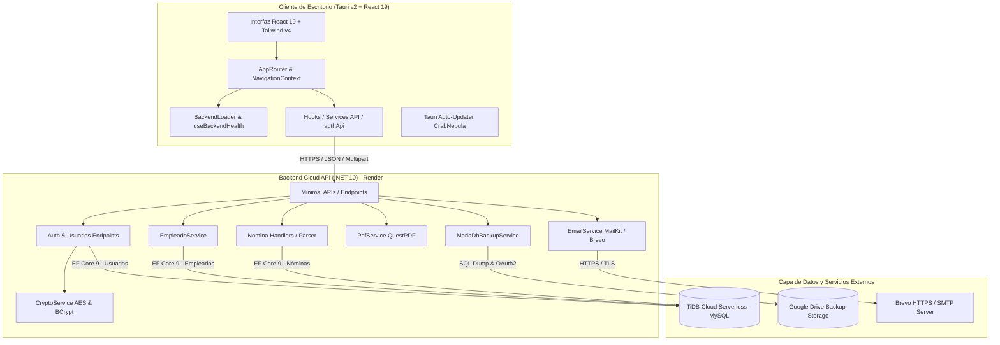

# 🏢 Sistema de Nómina y Procesamiento Quincenal — ENFOCO

[](https://dotnet.microsoft.com/)
[](https://tauri.app/)
[](https://react.dev/)
[](https://tailwindcss.com/)
[-4479A1?logo=mysql&logoColor=white)](https://tidbcloud.com/)
[](https://sistemanomina.onrender.com)
[](#)

---

## 📑 Tabla de Contenidos
1. [Visión General y Contexto No Técnico](#-1-visión-general-y-contexto-no-técnico)
   - [¿Qué es el Sistema de Nómina ENFOCO?](#qué-es-el-sistema-de-nómina-enfoco)
   - [Problemas de Negocio que Resuelve](#problemas-de-negocio-que-resuelve)
   - [Flujo de Trabajo Operativo](#flujo-de-trabajo-operativo)
   - [Módulos Principales del Negocio](#módulos-principales-del-negocio)
   - [Beneficios Clave para la Organización](#beneficios-clave-para-la-organización)
2. [Arquitectura y Contexto Técnico](#-2-arquitectura-y-contexto-técnico)
   - [Pila Tecnológica Integral](#pila-tecnológica-integral)
   - [Diagrama de Arquitectura de la Solución](#diagrama-de-arquitectura-de-la-solución)
   - [Estructura del Proyecto y Repositorio](#estructura-del-proyecto-y-repositorio)
   - [Modelo de Datos y Persistencia](#modelo-de-datos-y-persistencia)
   - [Catálogo de Endpoints y API REST](#catálogo-de-endpoints-y-api-rest)
   - [Reglas de Negocio Fiscales y Laborales (República Dominicana)](#reglas-de-negocio-fiscales-y-laborales-república-dominicana)
   - [Seguridad, Criptografía y Respaldos en Nube](#seguridad-criptografía-y-respaldos-en-nube)
   - [Pruebas Automatizadas y Aseguramiento de Calidad](#pruebas-automatizadas-y-aseguramiento-de-calidad)
3. [Guía de Instalación, Configuración y Despliegue](#-3-guía-de-instalación-configuración-y-despliegue)
   - [Requisitos Previos del Sistema](#requisitos-previos-del-sistema)
   - [Ejecución en Entorno de Desarrollo](#ejecución-en-entorno-de-desarrollo)
   - [Compilación y Empaquetado de la Aplicación de Escritorio](#compilación-y-empaquetado-de-la-aplicación-de-escritorio)
   - [Despliegue del Backend con Docker / Render](#despliegue-del-backend-con-docker--render)
4. [Historial de Versiones Recientes](#-4-historial-de-versiones-recientes)

---

## 🏢 1. Visión General y Contexto No Técnico

### ¿Qué es el Sistema de Nómina ENFOCO?
El **Sistema de Nómina y Procesamiento Quincenal ENFOCO** es una plataforma integral de escritorio corporativa (compatible con **Windows**, **macOS** y **Linux / CachyOS**) diseñada para automatizar, blindar y agilizar la gestión de recursos humanos y el cálculo de nóminas quincenales en empresas e instituciones.

Permite administrar el catálogo maestro de empleados, importar planillas de pago en formato Excel sin importar su orden de columnas, verificar los importes en tiempo real, liquidar las nóminas con trazabilidad histórica inalterable, generar automáticamente volantes de pago institucionales en PDF y enviarlos masivamente a los correos de los colaboradores con un solo clic.

---

### Problemas de Negocio que Resuelve

| Desafío Tradicional | Solución Implementada en ENFOCO |
| :--- | :--- |
| **Acceso no autorizado y falta de control de perfiles**: Riesgo de manipulación no supervisada de nóminas y expedientes de empleados. | **Autenticación Blindada y Control de Roles**: Inicio de sesión obligatorio con contraseñas seguras, perfiles diferenciados (`Admin`, `RRHH`, `Contador`, `Auditor`, `Operador`) y trazabilidad de último acceso. |
| **Errores en archivos Excel cambiantes**: Si las columnas cambian de orden o se usan nombres distintos, los sistemas convencionales fallan. | **Motor Inteligente de Excel Universal**: Detecta automáticamente encabezados, alias sinónimos, formatos numéricos con símbolos de moneda y caracteres especiales. |
| **Duplicación de trabajo y discrepancias**: Empleados en planilla que no existen en el sistema o viceversa. | **Cruce Automático en Tiempo Real**: Valida códigos de empleados contra el maestro centralizado, alertando de registros no encontrados antes del cierre. |
| **Entrega lenta y manual de recibos de pago**: Descargar PDFs uno por uno y enviarlos por correo manual consume horas de trabajo de RRHH. | **Generación y Despacho Masivo en Segundos**: Generación instantánea de PDFs con diseño institucional y envío automático vía API en la nube (Brevo / SMTP) con informe de entregas. |
| **Pérdida de trazabilidad histórica**: Imposibilidad de auditar nóminas pasadas o reimprimir comprobantes idénticos. | **Histórico Inmutable y Auditable**: Toda quincena procesada queda sellada en base de datos con filtros por año, mes, quincena y exportación a Excel. |
| **Cumplimiento legal y fiscal en Rep. Dominicana**: Errores en retención de TSS (AFP/SFS), ISR según escalas DGII y cédulas inválidas. | **Validación y Cálculo Fiscal Normativo**: Validador de cédula mediante algoritmo Módulo 10 y cálculo de deducciones ajustado a la ley dominicana. |

---

### Flujo de Trabajo Operativo

```
 ┌─────────────────┐       ┌────────────────┐       ┌─────────────────┐       ┌─────────────────┐
 │ 0. Autenticación│ ───>  │ 1. Maestro de  │ ───>  │ 2. Carga Excel  │ ───>  │ 3. Staging &    │
 │    y Acceso     │       │    Empleados   │       │    Quincenal    │       │    Previsualizar│
 └─────────────────┘       └────────────────┘       └─────────────────┘       └─────────────────┘
                                                                                       │
 ┌─────────────────┐       ┌────────────────┐                                          ▼
 │ 6. Gestión de   │       │ 5. Envío Masivo│ <───  ┌─────────────────┐ <──────────────┘
 │    Usuarios     │       │    de Volantes │       │ 4. Cierre de    │
 └─────────────────┘       └────────────────┘       │    Nómina       │
                                                    └─────────────────┘
```

0. **Autenticación y Seguridad**: Inicio de sesión corporativo validando credenciales y asignando nivel de acceso según el rol.
1. **Gestión de Empleados**: Registro, edición y mantenimiento de datos personales, laborales, bancarios y de contacto.
2. **Carga de Novedades Quincenales**: Arrastre de la hoja de cálculo de la quincena (con sueldos, incentivos, horas extras, deducciones, préstamos).
3. **Mesa de Trabajo / Staging**: Inspección visual de las partidas, corrección de inconsistencias en caliente y recálculo automático de devengados, deducciones y neto a pagar.
4. **Cierre y Sellado**: Confirmación formal que guarda la nómina histórica de forma definitiva.
5. **Generación y Despacho**: Visualización individual de comprobantes PDF y envío masivo por correo electrónico a cada colaborador.
6. **Administración de Usuarios y Perfiles**: Alta, edición, asignación de permisos, activación/desactivación y auditoría de accesos del personal autorizado.

---

### Módulos Principales del Negocio

- 👥 **Módulo 1: Maestro de Personal y Empleados**
  - Directorio centralizado con búsqueda predictiva por nombre, apellido, cargo o cédula.
  - Indicadores clave de desempeño (KPIs): Total de plantilla, colaboradores activos e inactivos.
  - Sugerencia automática del próximo código correlativo para nuevos ingresos.
  - Validación en vivo de cédulas dominicanas y pasaportes.
  - Importación y exportación masiva en formato Excel (`.xlsx`).

- 💵 **Módulo 2: Procesamiento Quincenal de Pagos**
  - Asistente de carga rápida de planillas de pago.
  - Reconocimiento automático del período fiscal (1ra o 2da Quincena y Mes corriente).
  - Detección visual de discrepancias (empleados no registrados en el maestro).
  - Tabla interactiva con edición en caliente antes del cierre definitivo.

- 📄 **Módulo 3: Volantes de Pago Institucionales y Distribución Digital**
  - Recibos vectoriales en PDF de alta fidelidad con tipografía limpia universal *Arial*, logotipo institucional y desglose contable (Sueldo Base, Incentivos, Horas Extras, AFP, SFS, ISR, Préstamos, Neto en números y letras).
  - Visor interactivo integrado en la aplicación de escritorio.
  - Disparador de envío masivo de correos electrónicos con adjuntos personalizados y reintentos ante fallas temporales.

- 📜 **Módulo 4: Archivo Histórico y Auditoría**
  - Consulta retrospectiva de nóminas cerradas organizadas por Año, Mes y Quincena (`1Q` / `2Q`).
  - Motor de búsqueda global para auditar el historial salarial de un empleado en cualquier período.
  - Re-exportación oficial a Excel de períodos anteriores y reimpresión de comprobantes en PDF.

- 📅 **Módulo 5: Agenda y Calendario de Nómina**
  - Calendario mensual interactivo con visualización de días de corte, fechas límite de novedades y días de pago.
  - Gestión de eventos y recordatorios corporativos sincronizados con la base de datos central.

- 🔐 **Módulo 6: Seguridad, Autenticación y Control de Accesos (RBAC)**
  - Pantalla de inicio de sesión corporativa con validación inmediata y persistencia de sesión segura en Keyring del SO.
  - Panel administrativo de usuarios para altas, bajas y modificaciones completas de datos de acceso.
  - **Sistema de Control de Acceso Basado en Roles (RBAC)**: Matriz jerárquica con 9 permisos atómicos aplicados en tiempo real sobre la interfaz, menús, botones y rutas.
  - **Matriz de Permisos por Rol**:
    | Permiso Atómico | Descripción de la Capacidad | `Admin` | `RRHH` | `Contador` | `Operador` | `Auditor` |
    | :--- | :--- | :---: | :---: | :---: | :---: | :---: |
    | `usuarios:manage` | Crear, editar, activar/desactivar y borrar usuarios del sistema | ✅ | ❌ | ❌ | ❌ | ❌ |
    | `empleados:read` | Consultar catálogo de empleados, exportar a Excel y abrir fichas | ✅ | ✅ | ✅ | ✅ | ✅ |
    | `empleados:create` | Dar de alta nuevos colaboradores con código correlativo automático | ✅ | ✅ | ❌ | ✅ | ❌ |
    | `empleados:edit` | Modificar datos personales, salario, puesto, cuenta y estatus | ✅ | ✅ | ❌ | ✅ | ❌ |
    | `empleados:delete` | Eliminar físicamente registros de empleados del sistema | ✅ | ✅ | ❌ | ❌ | ❌ |
    | `nomina:read` | Consultar histórico de quincenas cerradas y visualizar volantes PDF | ✅ | ✅ | ✅ | ✅ | ✅ |
    | `nomina:process` | Cargar archivos Excel quincenales, previsualizar cálculos y liquidar | ✅ | ✅ | ✅ | ❌ | ❌ |
    | `volantes:send` | Despacho masivo por correo, reenvío individual y config SMTP | ✅ | ✅ | ✅ | ❌ | ❌ |
    | `eventos:manage` | Crear, editar y eliminar eventos y recordatorios en la agenda | ✅ | ✅ | ✅ | ❌ | ❌ |
  - **Protecciones Visuales y de Flujo**:
    - **Modo Consulta (Solo Lectura)**: Bloqueo automático con `<fieldset disabled>` de todos los campos del formulario y reemplazo del botón "Guardar" por un banner informativo para roles sin permiso de edición.
    - **Filtrado Dinámico de Módulos y Menús**: Ocultación preventiva de tarjetas en Dashboard (`ModuleNavigationGrid`), opciones en menú desplegable (`ActionsDropdown`) y botones de acción destructiva (papelera de eliminación).
    - **Guardias de Navegación Reactivas**: Redirección automática y alertas de acceso denegado en `AppRouter` ante cualquier intento de ingreso forzado por ruta.
  - Registro del último acceso al sistema para auditoría de seguridad.
  - Protección de superusuario: Bloqueo automático para impedir la eliminación o desactivación accidental del único Administrador activo.

---

### Beneficios Clave para la Organización

- **0% Errores de Cruce**: Garantiza que no se emitan pagos a personas no registradas o con cuentas bancarias erradas.
- **Ahorro de Tiempo**: Reduce el tiempo de liquidación y entrega de recibos de varias horas a escasos minutos.
- **Transparencia y Confianza Laboral**: Los empleados reciben oportunamente en sus correos un volante claro, detallado y profesional.
- **Respaldo y Seguridad**: Toda la información contable está respaldada de forma automática y cifrada en la nube.

---

## 💻 2. Arquitectura y Contexto Técnico

### Pila Tecnológica Integral

#### 🖥️ Frontend (Desktop Application)
- **Tauri v2**: Framework ultraligero basado en Rust para empaquetar aplicaciones nativas de escritorio seguras con bajo consumo de memoria y tamaño de binario reducido.
- **React 19**: Biblioteca declarativa de interfaces de usuario para una experiencia fluida y reactiva.
- **TypeScript 5.8**: Tipado estático riguroso para modelos, DTOs y componentes de UI.
- **Vite 7**: Servidor de desarrollo ultrarrápido y empaquetador optimizado.
- **Tailwind CSS v4**: Motor de utilidades CSS moderno con tokens de diseño personalizados.
- **Lucide Icons**: Conjunto de iconografía vectorial limpia y consistente.
- **SweetAlert2**: Notificaciones modales, confirmaciones y alertas enriquecidas.
- **Arquitectura de Navegación y Rutas**: Contexto global `NavigationContext` y enrutador centralizado `AppRouter` para navegación modular y desacoplada.
- **Resiliencia de Conexión en Nube**: Hook `useBackendHealth` y componente `BackendLoader` con sondeo automático para arranque en frío de la API.
- **Tauri Plugins**:
  - `@tauri-apps/plugin-updater`: Actualizaciones automáticas Over-The-Air (OTA) vía CrabNebula.
  - `@tauri-apps/plugin-process`: Gestión del ciclo de vida del proceso de escritorio.
  - `@tauri-apps/plugin-opener`: Apertura segura de archivos del sistema y enlaces web externos.

#### ⚙️ Backend (Cloud API Service)
- **.NET 10 (C# 14 / Minimal APIs)**: Arquitectura orientada a alto rendimiento, bajo consumo de recursos y endpoints ligeros.
- **Entity Framework Core 9 (Pomelo MySQL Provider)**: ORM con soporte completo de migraciones, transacciones ACID y consultas LINQ optimizadas.
- **BCrypt.Net-Next**: Hashing criptográfico unidireccional de contraseñas de usuarios con salting aleatorio dinámico (`workFactor: 12`).
- **QuestPDF**: Motor declarativo para renderizado vectorial de documentos PDF institucionales de alta resolución.
- **ExcelDataReader & ClosedXML**: Motores gemelos para lectura rápida sin dependencias COM y generación de libros Excel enriquecidos con extensiones de estilo.
- **MailKit & MimeKit**: Biblioteca cliente SMTP/IMAP para autenticación segura (STARTTLS / SSL) y manipulación de adjuntos MIME.
- **Brevo REST API (HTTPS)**: Canal secundario y nativo para despacho de correos transaccionales directos desde la nube vía HTTP.
- **DataProtection & Cryptography**: Cifrado AES-256 de credenciales sensibles (claves SMTP) almacenadas en base de datos.
- **Google Drive API v3**: Servicio de respaldo periódico automatizado con autenticación OAuth2 de ciclo continuo mediante Refresh Tokens.
- **Swashbuckle / OpenAPI**: Documentación y consola interactiva de pruebas de la API disponible en `/swagger`.

#### ☁️ Infraestructura y Base de Datos
- **Base de Datos Principal**: TiDB Cloud Serverless (Compatible con MySQL 8.0) alojado en AWS Oregon con conexión SSL/TLS obligatoria y disponibilidad 24/7 permanente.
- **Alojamiento Backend**: Contenedor Linux Dockerizado en **Render** (`https://sistemanomina.onrender.com`).
- **Monitoreo Continuo**: Sonda HTTP en **UptimeRobot** sobre `/api/health` cada 5 minutos para garantizar operación activa 24/7.
- **Almacenamiento de Respaldos**: Google Drive Cloud Storage con retención inteligente de copias de seguridad.

---

### Diagrama de Arquitectura de la Solución



---

### Estructura del Proyecto y Repositorio

```
SistemaNomina/
├── backend/                               # Proyecto API .NET 10
│   ├── Common/                            # Extensiones, validación de permisos y filtros de seguridad
│   │   ├── NominaCalculoExtensions.cs     # Cálculos auxiliares de nómina
│   │   ├── Permissions.cs                 # Matriz de roles y evaluación de permisos en backend
│   │   └── SessionAuthFilter.cs           # Filtro de endpoints para validación de sesiones y permisos
│   ├── Data/
│   │   ├── AppDbContext.cs                # Contexto de base de datos EF Core (Empleados, Nóminas, Usuarios, Auditoría)
│   │   └── DbInitializer.cs               # Semillero inicial de datos y usuario administrador por defecto
│   ├── DTOs/                              # Objetos de Transferencia de Datos (AuthDTOs, Empleados, Nomina)
│   ├── Endpoints/                         # Rutas Minimal API (/api/auth, /api/usuarios, /api/empleados, /api/nomina, /api/config)
│   ├── Migrations/                        # Historial de migraciones EF Core (Tablas de nómina, usuarios y auditoría)
│   ├── Models/                            # Entidades del Dominio (Empleado, NominaPeriodo, Usuario, AuditoriaAccion...)
│   ├── Nomina/                            # Lógica CQRS de Cierre de Nómina y Agenda de Eventos
│   │   ├── Commands/                      # Comandos de procesamiento, eventos y despacho de volantes
│   │   └── Queries/                       # Consultas de histórico y eventos de calendario
│   ├── Queries/                           # Handlers de exportación a Excel (Empleados y Nómina)
│   ├── Services/
│   │   ├── Excel/                         # Parsers universales resilientes y extensiones ClosedXML
│   │   ├── Pdf/                           # Plantillas de Volantes de Pago QuestPDF y helpers
│   │   ├── CalculadorDeduccionesRD.cs     # Deducciones fiscales de Rep. Dominicana (TSS y escalas ISR DGII)
│   │   ├── ValidadorDocumentoRD.cs        # Algoritmo Módulo 10 para Cédula RD y pasaporte
│   │   ├── EmailService.cs                # Despacho por Brevo HTTPS REST API / MailKit SMTP
│   │   ├── CryptoService.cs               # Cifrado AES de credenciales sensibles del sistema
│   │   ├── AuditoriaHelper.cs             # Registro automatizado de eventos de seguridad y auditoría
│   │   └── MariaDbBackupService.cs        # Motor de copias de seguridad a Google Drive
│   ├── Dockerfile                         # Contenedor optimizado de producción
│   └── Program.cs                         # Configuración del Host, DI, BCrypt, Rate Limiting y Middlewares
├── backend.Tests/                         # Suite de Pruebas Unitarias e Integración (xUnit)
│   ├── CryptoServiceTests.cs              # Pruebas de cifrado/descifrado
│   ├── NominaFallbackTests.cs             # Pruebas del parser universal de Excel
│   ├── ValidadorDocumentoRDTests.cs       # Pruebas de validación de Cédulas RD
│   └── GenerarExcelPruebaTests.cs         # Generadores de matrices de prueba
├── sistema-nomina/                        # Aplicación Frontend de Escritorio
│   ├── src/                               # Código Fuente React 19 + TypeScript
│   │   ├── components/                    # Componentes modulares y reutilizables
│   │   │   ├── common/                    # Tablas, selectores, BackendLoader, modales
│   │   │   ├── dashboard/                 # Métricas, KPIs y accesos rápidos
│   │   │   ├── employees/                 # Formularios y listados de personal
│   │   │   ├── events/                    # Agenda y vista de calendario
│   │   │   ├── payroll/                   # Mesa de trabajo, visores PDF y modales
│   │   │   └── user/                      # Tabla de usuarios y modal de creación/edición
│   │   ├── config/                        # Configuración de URLs de API
│   │   ├── constants/                     # permissions.ts (Catálogo de permisos y matriz RBAC)
│   │   ├── context/                       # Contexto global de navegación y sesión (NavigationContext)
│   │   ├── hooks/                         # Hooks reactivos (useAuthorization, useEmployees, usePayroll...)
│   │   ├── pages/                         # Vistas principales (LoginPage, UsersManagementPage, Dashboard...)
│   │   ├── routes/                        # Enrutador centralizado (AppRouter)
│   │   ├── service/api/                   # Clientes de consumo HTTP (authApi, empleadosApi, nominaApi...)
│   │   └── types/                         # Definiciones de tipos TypeScript (usuario, empleado, nómina...)
│   ├── src-tauri/                         # Código Nativo Rust / Tauri v2
│   │   ├── src/main.rs                    # Entrypoint y configuración de plugins
│   │   └── tauri.conf.json                # Configuración de empaquetado, permisos y updater
│   ├── package.json                       # Dependencias y scripts de Node.js
│   └── vite.config.ts                     # Configuración de compilación Vite + Tailwind v4
└── README.md                              # Documentación del sistema
```

---

### Modelo de Datos y Persistencia

#### 1. Entidad `Empleado`
Representa el expediente maestro del colaborador.
- `Codigo` (string, PK, max 20, ej. `"EMP-001"`)
- `Nombres` (string, max 150, nombre completo)
- `TipoDocumento` (string, `"1"` para Cédula, `"2"` para Pasaporte)
- `Cedula` (string, max 20, validada con algoritmo Módulo 10 o pasaporte)
- `Puesto` (string, max 100, cargo u ocupación)
- `Email` (string, max 150, correo electrónico para distribución de volantes)
- `EStatus` (string: `"ACTIVO"` / `"INACTIVO"`)
- `FechaIngreso` & `FechaNacimiento` (DateTime?, fechas laborales y de natalicio)
- `FechaCreacion` & `FechaActualizacion` (DateTime, UTC)

#### 2. Entidad `NominaPeriodo`
Cabecera del cierre quincenal de nómina.
- `Id` (int, PK autoincremental)
- `Mes` (int, 1-12)
- `Quincena` (string: `"1Q"` o `"2Q"`)
- `Concepto` (string, max 150)
- `MontoTotalDevengado` (decimal(18,2))
- `MontoTotalDeducciones` (decimal(18,2))
- `MontoTotalNeto` (decimal(18,2))
- `FechaProcesado` (DateTime, UTC, el año fiscal se deriva de esta fecha)
- `Estado` (string: `"PROCESADO"`)
- `Detalles` (ICollection<`NominaDetalle`>)

#### 3. Entidad `NominaDetalle`
Desglose individual e inalterable de la liquidación de cada empleado en un período.
- `Id` (int, PK autoincremental)
- `NominaPeriodoId` (FK a `NominaPeriodo`)
- `CodigoEmpleado` (string, max 20)
- `NombreEmpleadoSnapshot` (string, max 150)
- `CedulaSnapshot` & `EmailDestinatario` (string, datos de contacto al momento del cierre)
- `SueldoPeriodo`, `Incentivo`, `Reembolso`, `HorasExtras` (decimal)
- `TotalDevengado` (decimal)
- `SeguroVehiculo`, `SeguroMedico`, `CuotaCumpleanos`, `Prestamo` (decimal)
- `Sfs` (retención TSS 3.04%), `Afp` (retención TSS 2.87%), `Isr` (escala progresiva DGII)
- `TotalDeducciones` (decimal)
- `NetoPagado` (decimal)
- `CorreoEnviado` (bool) & `FechaEnvioCorreo` (DateTime?, trazabilidad de despacho)

#### 4. Entidad `EventoRecordatorio`
Eventos corporativos y recordatorios en el calendario.
- `Id` (int, PK autoincremental)
- `Titulo` (string, max 200) & `Subtitulo` (string)
- `FechaHora` (DateTime)
- `TipoEvento` (string: `"payroll-pending"`, `"pdf-dispatch"`, `"payroll-completed"`, `"general-reminder"`)
- `Prioridad` (string: `"ALTA"`, `"MEDIA"`, `"BAJA"`)
- `Descripcion`, `AdjuntoNombre`, `TextoAccion` (string)
- `FechaCreacion` (DateTime)

#### 5. Entidad `ConfiguracionSistema`
Parámetros globales de la aplicación y credenciales SMTP cifradas.
- `SmtpServer`, `SmtpPort`, `SmtpSenderName`, `SmtpSenderEmail`, `SmtpUsername`
- `SmtpPassword` (cadena cifrada en AES-256)
- `SmtpEnableSsl` (bool)

#### 6. Entidad `Usuario`
Representa las cuentas de acceso y administración del sistema.
- `Id` (int, PK autoincremental)
- `NombreCompleto` (string, max 150)
- `Email` (string, max 150, índice único normalizado en minúsculas)
- `PasswordHash` (string, hash BCrypt con factor de trabajo 12)
- `Rol` (string: `"Admin"`, `"RRHH"`, `"Contador"`, `"Auditor"`, `"Operador"`)
- `PermisosJson` (string, array JSON con capacidades habilitadas o `["*"]`)
- `Activo` (bool, estado de habilitación de la cuenta)
- `UltimoAcceso` (DateTime?, marca de tiempo UTC del último inicio de sesión exitoso)
- `FechaCreacion` & `FechaActualizacion` (DateTime, UTC)

#### 7. Entidad `SesionUsuario`
Control y persistencia de tokens de sesión para autenticación biométrica/recordada (*Remember Me*).
- `Id` (int, PK autoincremental)
- `UsuarioId` (FK a `Usuario`)
- `Token` (string de 64 caracteres hexadecimales, índice único criptográfico)
- `FechaCreacion` & `UltimoUso` (DateTime, UTC)
- `FechaExpiracion` (DateTime, vigencia de 30 días renovable automáticamente)
- `Dispositivo` (string, descriptor del cliente desktop)
- `Activa` (bool, revocabilidad remota inmediata)

#### 8. Entidad `AuditoriaAccion`
Trazabilidad de seguridad, eventos del sistema y registros de cambios.
- `Id` (int, PK autoincremental)
- `UsuarioId` (FK a `Usuario`)
- `Modulo` (string: `"AUTH"`, `"EMPLEADOS"`, `"NOMINA"`, `"EVENTOS"`)
- `Tipo` (string: `"info"`, `"action"`, `"warn"`, `"error"`)
- `Tarea` (string, descripción sintética de la acción)
- `Detalles` (string, parámetros y metadatos de la operación)
- `FechaHora` (DateTime, UTC, con índice para consultas cronológicas)
- `DireccionIp` & `Dispositivo` (string, registro pericial y de origen)

---

### 🛡️ Arquitectura de Autorización y Control de Acceso (RBAC)

El sistema implementa un modelo **Role-Based Access Control (RBAC)** integral, con validación simétrica en dos capas: **Interfaz de Usuario (Frontend)** y **Blindaje en Endpoints (Backend)**:

#### 1. Capa de Frontend (React 19 / Vite / Tauri v2)
- **Catálogo de Permisos y Matriz Centralizada (`src/constants/permissions.ts`)**: Define el tipo `Permission` con los 9 permisos atómicos del sistema (`usuarios:manage`, `empleados:read`, `empleados:create`, `empleados:edit`, `empleados:delete`, `nomina:read`, `nomina:process`, `volantes:send`, `eventos:manage`) y su matriz por rol (`DEFAULT_ROLE_PERMISSIONS`).
- **Resolución Dinámica de Permisos (`getUserPermissions`)**: Combina en caliente los permisos por defecto del rol con los permisos específicos almacenados en `user.permisosJson`.
- **Hook Reactivo (`src/hooks/useAuthorization.ts`)**: Banderas booleanas (`canManageUsers`, `canCreateEmployee`, `canEditEmployee`, `canDeleteEmployee`, `canProcessPayroll`, `canReadPayroll`, `canSendPaystubs`, `canManageEvents`, `isReadOnly`) para el renderizado condicional de vistas y acciones.
- **Interceptors Globales de Axios (`src/config/api.ts`)**:
  - **Request Interceptor**: Extrae el token de sesión de `localStorage` (`auth_user`) y lo adjunta automáticamente en la cabecera `Authorization: Bearer <token>` en cada petición HTTP hacia el backend.
  - **Response Interceptor**: Captura respuestas `401 Unauthorized` (sesión expirada o revocada) y purga las credenciales locales de forma controlada.

#### 2. Capa de Backend (.NET 10 Minimal APIs)
- **Fuente de Verdad en Backend (`backend/Common/Permissions.cs`)**: Espejo exacto de la matriz de roles y permisos del frontend, con el método estático `TienePermiso(Usuario usuario, string permisoRequerido)` que evalúa roles (`Admin` con acceso irrestricto `*`), permisos de rol por defecto y permisos personalizados deserializados desde `PermisosJson`.
- **Filtro de Endpoints Reutilizable (`backend/Common/SessionAuthFilter.cs`)**:
  - Intercepta solicitudes entrantes y extrae el token de autorización Bearer.
  - Consulta en base de datos la tabla `SesionesUsuarios` incluyendo al `Usuario`.
  - Verifica vigencia temporal (`FechaExpiracion > UtcNow`), estado de sesión (`Activa == true`) y habilitación de la cuenta (`Usuario.Activo == true`).
  - Inyecta la entidad `Usuario` en `HttpContext.Items["CurrentUser"]` para trazabilidad y auditoría.
  - Evalúa los permisos granulares requeridos: responde `401 Unauthorized` si la sesión no es válida y `403 Forbidden` si el usuario no cuenta con el permiso requerido.
  - Expone métodos de extensión fluidos: `.RequireSession()` y `.RequirePermission(permiso)`.
- **Reglas Anti-Elevación de Privilegios**: En `POST /api/usuarios` y `PUT /api/usuarios/{id}`, se verifica que únicamente un usuario con rol `Admin` autenticado pueda crear, promover o editar usuarios con perfil `Admin`.
- **Generación Permanente de Sesiones**: El endpoint `/api/auth/login` emite siempre un token seguro (30 días si se activa *Remember Me*, o 24 horas para sesiones estándar) para respaldar el flujo autenticado.

---

### Catálogo de Endpoints y API REST

#### 🔐 Módulo de Autenticación (`/api/auth`)
- `POST /api/auth/login`: Autentica credenciales con BCrypt, comprueba estado activo, registra `UltimoAcceso` y genera siempre un token de sesión seguro (30 días con *Remember Me*, 24 horas estándar).
- `POST /api/auth/verificar-sesion`: Valida la vigencia del token de sesión en BD, renueva su expiración por 30 días y retorna los datos del usuario.
- `POST /api/auth/cerrar-sesion`: Invalida inmediatamente el token de sesión en base de datos (`Activa = false`).

#### 👤 Módulo de Gestión de Usuarios (`/api/usuarios`) — 🔒 Requiere: `usuarios:manage`
- `GET /api/usuarios`: Consulta la lista completa de usuarios registrados ordenados por nombre.
- `GET /api/usuarios/{id}`: Obtiene el expediente de un usuario por su identificador.
- `GET /api/usuarios/{id}/auditoria`: Consulta el historial de acciones y auditoría de seguridad del usuario.
- `POST /api/usuarios`: Registra un nuevo usuario con BCrypt (`workFactor: 12`). Solo administradores pueden crear usuarios con rol `Admin`.
- `PUT /api/usuarios/{id}`: Actualiza perfil, rol, permisos y contraseña. Bloquea la auto-promoción o edición de administradores por no-administradores.
- `DELETE /api/usuarios/{id}`: Elimina físicamente a un usuario (protección contra eliminación del último administrador activo).

#### 👥 Módulo de Empleados (`/api/empleados`)
- `GET /api/empleados`: Consulta paginada con filtros y conteos agregados. 🔒 Requiere: `empleados:read`
- `GET /api/empleados/siguiente-codigo`: Retorna el próximo código correlativo sugerido. 🔒 Requiere: `empleados:read`
- `GET /api/empleados/exportar-excel`: Exporta el catálogo maestro a `.xlsx`. 🔒 Requiere: `empleados:read`
- `POST /api/empleados`: Registra un nuevo empleado validando documento. 🔒 Requiere: `empleados:create`
- `POST /api/empleados/guardar-lote`: Sincronización masiva de empleados (Upsert). 🔒 Requiere: `empleados:create`
- `PUT /api/empleados/{codigo}`: Actualiza los datos de un empleado existente. 🔒 Requiere: `empleados:edit`
- `POST /api/empleados/toggle-estatus-todos`: Activa o desactiva a todos los empleados en bloque. 🔒 Requiere: `empleados:edit`
- `DELETE /api/empleados/{codigo}`: Elimina un empleado del sistema. 🔒 Requiere: `empleados:delete`

#### 💵 Módulo de Nómina Quincenal (`/api/nomina`)
- `POST /api/nomina/preview-quincena`: Carga el Excel y ejecuta el cruce con la BD. 🔒 Requiere: `nomina:process`
- `POST /api/nomina/recalcular`: Recalcula netos individuales y totales consolidados. 🔒 Requiere: `nomina:process`
- `POST /api/nomina/procesar-quincena`: Cierre y sellado definitivo de nómina en BD. 🔒 Requiere: `nomina:process`
- `GET /api/nomina/historico`: Consulta de nóminas históricas con filtros. 🔒 Requiere: `nomina:read`
- `GET /api/nomina/exportar-excel/{id}`: Exporta a Excel el detalle de una nómina procesada. 🔒 Requiere: `nomina:read`
- `POST /api/nomina/generar-volante-pdf`: Genera el volante de pago individual en PDF. 🔒 Requiere: `volantes:send`
- `POST /api/nomina/enviar-volantes-correo`: Despacho masivo de volantes PDF por correo. 🔒 Requiere: `volantes:send`
- `GET /api/nomina/periodo-sugerido`: Retorna el período fiscal inferido. 🔒 Requiere: Sesión activa (`RequireSession`)
- `GET /api/nomina/eventos-calendario`: Consulta los eventos de la agenda. 🔒 Requiere: `eventos:manage`
- `POST /api/nomina/eventos`, `PUT /api/nomina/eventos/{id}`, `DELETE /api/nomina/eventos/{id}`: CRUD de eventos en el calendario. 🔒 Requiere: `eventos:manage`

#### ⚙️ Configuración del Sistema (`/api/config`)
- `GET /api/config/smtp` & `POST /api/config/smtp`: Obtiene y guarda las credenciales SMTP cifradas. 🔒 Requiere: `usuarios:manage`
- `GET /api/config/periodos-disponibles`: Años, meses y quincenas registrados. 🔒 Requiere: Sesión activa (`RequireSession`)
- `GET /api/config/catalogos`: Tipos de documento y estatus válidos. 🔒 Requiere: Sesión activa (`RequireSession`)
- `GET /api/health`: Estado operativo de la API y marca de tiempo (Público).

---

### Reglas de Negocio Fiscales y Laborales (República Dominicana)

1. **Validación de Cédula de Identidad (Algoritmo Módulo 10 / Luhn)**:
   - Toda cédula dominicana de 11 dígitos se somete a validación de dígito verificador multiplicando ponderaciones alternas (1 y 2), sumando dígitos y evaluando congruencia modular (`ValidadorDocumentoRD.cs`).
2. **Seguridad Social (TSS)**:
   - **AFP (Fondo de Pensiones)**: Retención al empleado del **2.87%** sobre el salario cotizable hasta el tope legal de 20 salarios mínimos nacionales.
   - **SFS (Seguro Familiar de Salud)**: Retención al empleado del **3.04%** sobre el salario cotizable hasta el tope legal de 10 salarios mínimos nacionales.
3. **Impuesto Sobre la Renta (ISR - DGII)**:
   - Proyección del salario neto imponible anualizado descontando aportes de TSS.
   - Aplicación de las escalas progresivas de la DGII (Exento hasta RD\$ 416,220.00 anuales; 15%, 20% y 25% en los excedentes respectivos) y fraccionamiento a retención quincenal.

---

### Seguridad, Criptografía y Respaldos en Nube

- **Autenticación y Criptografía de Contraseñas (BCrypt)**: Se utiliza `BCrypt.Net-Next` con factor de costo configurable (`workFactor = 12`). Por cada contraseña se genera una sal aleatoria criptográfica, protegiendo las credenciales contra ataques de diccionario y *rainbow tables*.
- **Persistencia Segura y "Remember Me" Multiplataforma (Keyring Nativo & Tokens en BD)**: Integración con el gestor criptográfico oficial del sistema operativo en Rust vía `keyring` (Secret Service / KWallet en Linux/CachyOS, Windows Credential Manager DPAPI en Windows y Apple Keychain en macOS). Los tokens generados criptográficamente (256 bits) se asocian en TiDB con expiración rotativa a 30 días, permitiendo revocación remota en tiempo real al desactivar una cuenta o cerrar sesión.
- **Protección de Superusuarios y Reglas de Integridad**: Endpoints protegidos contra autosabotaje operativo, denegando la eliminación del único Administrador activo del sistema.
- **Normalización e Inmunidad de Credenciales**: Los correos electrónicos se limpian y normalizan en minúsculas en backend (`.Trim().ToLower()`), evitando duplicados con mayúsculas/minúsculas.
- **Cifrado de Secretos**: `CryptoService` utiliza el proveedor de protección de datos de .NET (`IDataProtector` / AES-256) para que las claves de los servidores de correo nunca queden expuestas en texto claro en la base de datos.
- **Políticas CORS**: Restricción de orígenes y cabeceras para permitir comunicación segura exclusivamente desde la aplicación cliente Tauri y entornos autorizados.
- **Respaldos Automáticos y Cifrado en Google Drive**: El servicio `MariaDbBackupService` realiza copias de seguridad de la base de datos relacional completa (incluyendo configuraciones, catálogo de empleados, cabeceras y desgloses de nóminas, agenda de eventos, cuentas de usuarios, sesiones activas y pistas de auditoría), comprime a formato ZIP, aplica cifrado simétrico AES-256 antes de salir del servidor y las sube automáticamente a la carpeta designada en Google Drive utilizando credenciales de servicio con tokens de actualización continua, manteniendo una retención rotativa de hasta 48 copias históricas.

---

### Pruebas Automatizadas y Aseguramiento de Calidad

El proyecto incluye una suite completa de pruebas unitarias e integración en el directorio `backend.Tests/` construida con **xUnit** y **FluentAssertions**:
- `ValidadorDocumentoRDTests.cs`: Comprobación exhaustiva de cédulas dominicanas reales, formatos con y sin guiones, pasaportes alfanuméricos y detección de anomalías.
- `CryptoServiceTests.cs`: Garantía de simetría de cifrado y descifrado de credenciales del sistema.
- `NominaFallbackTests.cs`: Pruebas de estrés contra 6 variantes de hojas de Excel exóticas (encabezados en filas variables, alias sinónimos, columnas desordenadas, formatos monetarios con símbolos de pesos/dólares, celdas numéricas con formato texto).
- `GenerarExcelPruebaTests.cs`: Generación automatizada de archivos de prueba reproducibles para auditoría.

---

## 🚀 3. Guía de Instalación, Configuración y Despliegue

### Requisitos Previos del Sistema

- **Sistema Operativo**: Windows 10/11, macOS 12+ o Linux (CachyOS, Arch, Ubuntu 22.04+).
- **Entorno de Ejecución**:
  - [.NET 10 SDK](https://dotnet.microsoft.com/download/dotnet/10.0)
  - [Node.js 20 LTS o superior](https://nodejs.org/) y [pnpm](https://pnpm.io/) (`npm install -g pnpm`)
  - [Rust y Cargo](https://rustup.rs/) (requerido para compilar la aplicación Tauri de escritorio)
  - Dependencias nativas de Linux (solo si compilas en Linux): `webkit2gtk-4.1`, `libappindicator-gtk3`, `librsvg2-dev`.

---

### Ejecución en Entorno de Desarrollo

#### 1. Iniciar el Backend (.NET 10)
```bash
# Navegar al directorio del backend
cd backend

# Restaurar dependencias y ejecutar
dotnet restore
dotnet run
```
> La API quedará escuchando en `http://localhost:5289` y la documentación interactiva Swagger estará accesible en `http://localhost:5289/swagger`.

#### 2. Iniciar el Frontend de Escritorio (Tauri + React)
```bash
# En una nueva terminal, navegar al frontend
cd sistema-nomina

# Instalar dependencias
pnpm install

# Iniciar la aplicación de escritorio en modo desarrollo con Hot-Reload
pnpm tauri dev
```

#### 3. Ejecutar las Pruebas Unitarias
```bash
cd backend.Tests
dotnet test --logger "console;verbosity=normal"
```

---

### Compilación y Empaquetado de la Aplicación de Escritorio

Para generar los instaladores listos para distribución final a los usuarios:

```bash
cd sistema-nomina
pnpm tauri build
```
Los artefactos generados se ubicarán en `sistema-nomina/src-tauri/target/release/bundle/`:
- **Linux**: Paquetes `.deb` y ejecutables universales `.AppImage`.
- **Windows**: Instaladores `.msi` y ejecutables `.exe`.
- **macOS**: Archivos de imagen de disco `.dmg` y paquetes `.app`.

---

### Despliegue del Backend con Docker / Render

El repositorio incluye un `Dockerfile` optimizado multi-etapa para compilar y ejecutar el backend en entornos de contenedores en la nube:

```bash
# Construir imagen Docker local
docker build -t sistema-nomina-backend -f Dockerfile .

# Ejecutar contenedor vinculando el puerto
docker run -d -p 5289:5289 -e PORT=5289 --name nomina-api sistema-nomina-backend
```

En **Render**, el servicio está configurado como un *Web Service* conectado a este repositorio con despliegue continuo ante cada commit en la rama principal.

---

## 📌 4. Historial de Versiones Recientes

- **v0.3.3 (Blindaje Integral Backend RBAC & Interceptores Axios)**:
  - **Filtro de Endpoints de Sesión y Permisos (`SessionAuthFilter.cs`)**: Interceptor nativo para Minimal APIs de ASP.NET Core que valida en tiempo real la existencia, expiración y estado activo de sesiones en la tabla `SesionesUsuarios`, inyectando el usuario autenticado en `HttpContext.Items["CurrentUser"]`.
  - **Matriz de Permisos en Backend (`Permissions.cs`)**: Centralización de la matriz de roles y evaluación estricta de permisos (`TienePermiso`), asegurando que el backend sea la fuente de verdad inmutable.
  - **Blindaje Total de Rutas de la API**:
    - `/api/usuarios`: Restringido exclusivamente con `usuarios:manage`. Verificación estricta de no-elevación de privilegios en `POST` y `PUT` (solo un `Admin` puede crear o editar usuarios con rol `Admin`).
    - `/api/empleados`: Métodos protegidos con `empleados:read`, `empleados:create`, `empleados:edit` y `empleados:delete`.
    - `/api/nomina`: Cierres y cálculos protegidos con `nomina:process`, históricos con `nomina:read`, volantes con `volantes:send` y agenda con `eventos:manage`.
    - `/api/config`: Credenciales SMTP protegidas con `usuarios:manage`; períodos y catálogos protegidos con sesión activa.
  - **Generación Permanente de Sesiones**: `/api/auth/login` emite siempre un token de sesión (30 días para *Remember Me*, 24 horas estándar).
  - **Interceptores Globales de Axios (`api.ts`)**:
    - Inyección automática de `Authorization: Bearer <tokenSesion>` en cada petición HTTP hacia el backend.
    - Manejo de respuestas `401 Unauthorized` con purga segura de credenciales en `localStorage`.

- **v0.3.2 (Seguridad Integral RBAC & Control de Acceso por Roles en Frontend)**:
  - **Matriz Oficial de Permisos (RBAC)**: Implementación del catálogo de permisos granulares (`src/constants/permissions.ts`) con 9 capacidades atómicas (`usuarios:manage`, `empleados:read`, `empleados:create`, `empleados:edit`, `empleados:delete`, `nomina:read`, `nomina:process`, `volantes:send`, `eventos:manage`) estructuradas para los 5 roles del sistema (`Admin`, `RRHH`, `Contador`, `Operador`, `Auditor`).
  - **Unificación Dinámica de Permisos (`getUserPermissions`)**: Algoritmo híbrido que resuelve en tiempo real los permisos del rol predeterminado combinándolos con las personalizaciones del JSON en base de datos sin requerir migraciones de datos ni deslogueos.
  - **Hook de Autorización Centralizado (`useAuthorization.ts`)**: Abstracción reactiva que provee banderas de decisión inmediata para todos los componentes de la aplicación.
  - **Protección Multicapa de Navegación e Interfaz**:
    - **Gestión de Usuarios**: Acceso restringido exclusivamente al rol `Admin`; módulo, tarjetas, menús y rutas completamente sellados para otros perfiles.
    - **Directorio y Expedientes de Personal**: Papelera de eliminación protegida solo para `Admin` y `RRHH`. Modo consulta con bloqueo de textboxes y selectores vía `<fieldset disabled>` para `Contador` y `Auditor`. Capacidad de alta y corrección de colaboradores para `Operador`.
    - **Mesa de Liquidación de Nómina**: Carga de planillas Excel oculta para `Auditor` y `Operador`, con forzado automático y exclusivo al histórico de nóminas.
    - **Distribución de Comprobantes**: Ocultación de botones masivos e individuales de envío por correo para perfiles no autorizados, garantizando la auditoría visual en formato PDF sin riesgo de despacho accidental.
    - **Agenda y Calendario**: Desactivación del doble clic sobre el calendario interactivo y ocultación de botones de edición/eliminación de eventos para `Auditor` y `Operador`.
  - **Inyección Automática de Permisos**: Guardado automático del JSON de permisos correspondiente al rol seleccionado tanto en creación como en actualización de usuarios (`CreateUserPage.tsx` y `UserFormModal.tsx`).

- **v0.3.1 (Desarrollo - Remember Me Seguro & Keyring Nativo)**:
  - **Persistencia de Sesión Segura Multiplataforma**: Integración de la biblioteca nativa `keyring` en Rust (Tauri v2) con soporte para *Secret Service / KWallet* en Linux/CachyOS, *Windows Credential Manager (DPAPI)* en Windows y *Apple Keychain* en macOS.
  - **Tokens Criptográficos en Base de Datos**: Creación del modelo y tabla `SesionesUsuarios` en TiDB Cloud Serverless con tokens de 256 bits (`RandomNumberGenerator`), expiración rotativa a 30 días y revocación remota en tiempo real.
  - **Endpoints de Sesión**: `POST /api/auth/verificar-sesion` para auto-login instantáneo al abrir la app y `POST /api/auth/cerrar-sesion` para invalidación del token.
  - **Experiencia de Usuario (UI/UX)**: Checkbox opcional *"Mantener mi sesión iniciada"* en [`LoginPage.tsx`](file:///home/daniele/Proyectos/SistemaNomina/sistema-nomina/src/pages/LoginPage.tsx), indicador suave *"Verificando sesión..."* en [`NavigationContext.tsx`](file:///home/daniele/Proyectos/SistemaNomina/sistema-nomina/src/context/NavigationContext.tsx), y tarjeta de perfil activo con botón para **Cerrar Sesión** en [`DashboardHeader.tsx`](file:///home/daniele/Proyectos/SistemaNomina/sistema-nomina/src/components/dashboard/DashboardHeader.tsx).
  - **Adaptador Dinámico de Entornos**: Detección automática en [`api.ts`](file:///home/daniele/Proyectos/SistemaNomina/sistema-nomina/src/config/api.ts) para alternar entre el backend local (`http://localhost:5289`) en desarrollo y la nube de Render (`https://sistemanomina.onrender.com`) en producción.
- **v0.3.0**:
  - **Módulo Integral de Autenticación y Control de Usuarios**: Vista de login corporativo, panel administrativo de gestión de usuarios (`UsersManagementPage`), creación modal/página (`CreateUserPage`, `UserFormModal`) y listado tabular con estados (`UsersTable`).
  - **Seguridad Criptográfica**: Hasheo de contraseñas con **BCrypt** (`workFactor: 12`), generación de sales criptográficas dinámicas, normalización de correos electrónicos y protección de superusuario para evitar la eliminación o desactivación del último Administrador activo.
  - **Perfiles y Roles de Negocio**: Soporte para roles jerárquicos (`Admin`, `RRHH`, `Contador`, `Auditor`, `Operador`) y permisos granulares en formato JSON.
  - **Refactorización de Navegación Frontend**: Arquitectura modular con [`AppRouter.tsx`](file:///home/daniele/Proyectos/SistemaNomina/sistema-nomina/src/routes/AppRouter.tsx) y [`NavigationContext.tsx`](file:///home/daniele/Proyectos/SistemaNomina/sistema-nomina/src/context/NavigationContext.tsx).
  - **Resiliencia de Conexión en la Nube**: Detección de estado del backend con [`useBackendHealth.ts`](file:///home/daniele/Proyectos/SistemaNomina/sistema-nomina/src/hooks/useBackendHealth.ts) y pantalla de sincronización inicial [`BackendLoader.tsx`](file:///home/daniele/Proyectos/SistemaNomina/sistema-nomina/src/components/common/BackendLoader.tsx) para tolerancia a arranques en frío.
  - **Persistencia y Migraciones**: Migración de base de datos EF Core `20260902154752_AgregarTablaUsuarios` y semillero automático del usuario administrador inicial.
- **v0.2.8**: Migración a **TiDB Cloud Serverless** (AWS Oregon) para alta disponibilidad y base de datos permanente de por vida, monitoreo 24/7 con UptimeRobot sobre `/api/health` y sincronización completa de los 15 colaboradores con histórico de nóminas.
- **v0.2.7**: Mejoras en recálculo en vivo de la mesa de trabajo de nómina y optimización de renderizado en componentes de distribución PDF.
- **v0.2.6**: Soporte nativo de backend en la nube (Render) y despacho de correos vía Brevo HTTPS REST API.
- **v0.2.5**: Integración del cliente Tauri con la URL de producción `https://sistemanomina.onrender.com`.
- **v0.2.4**: Soporte de Brevo SMTP con credenciales segregadas y cifrado AES-256.
- **v0.2.2**: Motor de parsing universal tolerante a matrices complejas de Excel.
- **v0.2.0**: Integración del sistema de auto-actualizaciones OTA con CrabNebula.

---

<div align="center">
  <sub>Desarrollado y mantenido para <b>ENFOCO</b>. Todos los derechos reservados.</sub>
</div>
